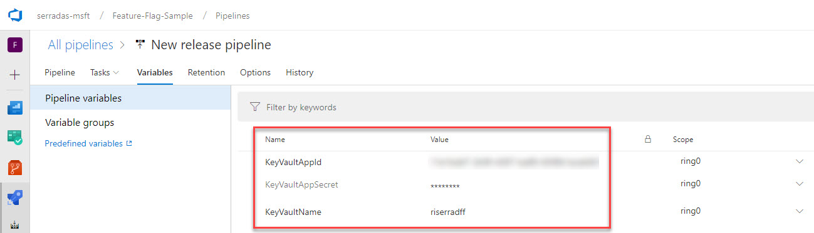
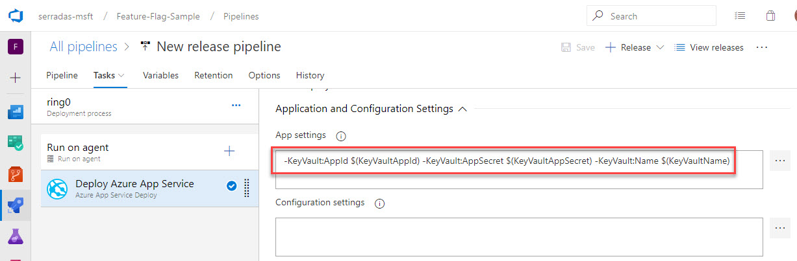

# Use Azure Key Vault to protect application secrets

This is the best practice to store application's sensitive data so you:

- Do not store sensitive information in your source control
  - Not even by mistake
- Do not store sensitive data on configuration files in your environment

**Source**: [https://docs.microsoft.com/en-us/azure/architecture/multitenant-identity/key-vault](https://docs.microsoft.com/en-us/azure/architecture/multitenant-identity/key-vault)

## Create/Configure the Key Vault

> Target platform: Windows
>
> So far, if you're operating on Linux or MacOS,
> please refer to [this link](01-key-vault-unix.md).

First, do the following steps to have the `Setup-KeyVault.ps1` script:

> I'm instructing you to clone my fork because the
> [Pull Request](https://github.com/mspnp/multitenant-saas-guidance/pull/108)
> was not approved yet.

- Clone `https://github.com/ricardoserradas/multitenant-saas-guidance.git`
- Checkout the branch `riserrad/fix-pwsh-scripts-kv`

```powershell
# Go to the script folder
cd multitenant-saas-guidance\scripts

# Create the Key Vault
.\Setup-KeyVault.ps1 `
  -KeyVaultName <<key vault name>> `
  -ResourceGroupName $resourceGroupName `
  -Location $resourcesLocation

# Add the Web App ID to the Access policies
# At this point, I needed to have my application already
# registered to the Azure Active Directory
.\Setup-KeyVault.ps1 `
  -KeyVaultName <<key vault name>> `
  -ApplicationIds @("<<Surveys app id>>", "<<Surveys.WebAPI app ID>>")

# Add the database connection string to the Key Vault
# At this point, I needed to have my Azure SQL database already created
.\Setup-KeyVault.ps1 `
  -SubscriptionId "<subscription-id>" `
  -ResourceGroupName $resourceGroupName `
  -KeyVaultName riserradff `
  -KeyName Data--MainDatabaseConnectionString `
  -KeyValue "<connection string to the Azure SQL database>"
```

### Improvements mapped

- [Provide guidance for generating certificate data for other platforms](https://github.com/MicrosoftDocs/architecture-center/issues/1416)
- [Fix missing parameters on PowerShell script](https://github.com/mspnp/multitenant-saas-guidance/pull/108)
- [Adjusting key-vault.md to support updates on Setup-KeyVault.ps1](https://github.com/MicrosoftDocs/architecture-center/pull/1418)
- [The article does not show hot to retrieve Secrets from Key Vault](https://github.com/MicrosoftDocs/architecture-center/issues/1492)
  - For a clear guidance on how to consume a Key Vault from a .NET Core App, use
  [this blog post](https://www.humankode.com/asp-net-core/how-to-store-secrets-in-azure-key-vault-using-net-core)
  as a reference

## Using the Key Vault from the Web App

Now that we have the Key Vault configured and the Connection String stored,
it is time to leverage Key Vault to store our sensitive configuration settings.

### Add the Key Vault capability to the App

From ASP.Net Core 2.0 and above, we do not need to add any extra package
to the project to use Azure Key Vault as a secret store. All we need
to do is tweak the `CreateWebHostBuilder` method, on `Program.cs`.

On a default `Program.cs`, you'll find something like this:

```csharp
public static IWebHostBuilder CreateWebHostBuilder(string[] args) =>
    WebHost.CreateDefaultBuilder(args)
        .UseStartup<Startup>();
```

Replace this piece of code with this:

```csharp
public static IWebHostBuilder CreateWebHostBuilder(string[] args) =>
    WebHost.CreateDefaultBuilder(args)
        .ConfigureAppConfiguration((context, config) => {
            if (context.HostingEnvironment.IsProduction()){
                var builtConfig = config.Build();

                config.AddAzureKeyVault(
                    $"https://{builtConfig["KeyVault:Name"]}.vault.azure.net/",
                    builtConfig["KeyVault:AppId"], 
                    builtConfig["KeyVault:AppSecret"]);
            }
        })
        .UseStartup<Startup>();
```

Notice the main difference: we add Azure Key Vault to the configuration
inside the `ConfigureAppConfiguration` method. But only when
`IsProduction()` is true.

We'll see how and where we store the `KeyVault:*` values below.

### Inject an instance of `IConfiguration` to the App

We're going to use Singleton to have an instance of `IConfiguration` available
to be used throughout the MVC application. To do so, notice that:

> We have a `private` declaration of an `IConfiguration`, which we later
instantiate on the `Startup` constructor:

```csharp
public IConfiguration Configuration { get; }

public Startup(IConfiguration configuration)
{
    Configuration = configuration;
}
```

> We inject the singleton to the App on the `ConfigureServices` method:

```csharp
services.AddSingleton<IConfiguration>(this.Configuration);
```

### Use the singleton instance within the app

Now that we have an instance of `IConfiguration` available for using
within the app, we need to use Dependency Injection on our MVC controllers
to have access to this instance.

To do it, we need to do two things:

> Declare a private field on the controllers we want/need to use it:

```csharp
private IConfiguration _configuration;
```

> Leverage the Dependency Injection to instantiate this field
on the controller constructor:

```csharp
public HomeController(IConfiguration configuration)
{
    this._configuration = configuration;
}
```

### Consume the Secrets from Azure Key Vault

Once the instance is available within the controller, it is just a matter of
using it. To do so, you can access Secrets like you were accessing values
from the `appconfig.json` file. For example:

```csharp
public IActionResult Index()
{
    ViewBag.SomeKey = this._configuration.GetValue<string>("KeyVault:Name");
    ViewBag.DataFromKeyVault = this._configuration.GetValue<string>("Data:MainDatabaseConnectionString");

    return View();
}
```

On the code above, notice that

```csharp
this._configuration.GetValue<string>("KeyVault:Name")`
```

is retrieving `KeyVault:Name` from the **Application Settings**, while

```csharp
this._configuration.GetValue<string>("Data:MainDatabaseConnectionString")
```

is retrieving `Data:MainDatabaseConnectionString` from the
**Key Vault** as we created [earlier](#Create/Configure-the-Key-Vault)
on this document.

The trick here is that this Secret is stored on the Key Vault as
`Data--MainDatabaseConnectionString`. **So, `:` should be used as `--`
on a Key Vault Secret name.**

### Do not store your Key Vault information on any configuration file

As you saw above, we need to retrieve the Key Vault information from the
Application Settings when injecting it to the App Configuration.

You'll also notice that we do not store it anywhere within our codebase.
This is because of two reasons:

> When developing locally, we're retrieving data from the
> `appsettings.Development.json` file, which has no sensitive information
> as you can see below:

```json
"Data": {
  "MainDatabaseConnectionString": "Server=(localdb)\\v11.0;Integrated Security=true;"
}
```

Notice that here, `Data:MainDatabaseConnectionString` points to our
sandbox SQL Local DB.

> We're adding the Key Vault information to
> the application at **deployment time**.

You can see below that we store the Key Vault information as Release Variables,
which we can later have different values per Release Stage:



And we're setting these values at deployment time on the
`Deploy Azure App Service` task:



These values will be available to the app when
[this code](#Add-the-Key-Vault-capability-to-the-App)
mentioned above runs from the cloud.

We're going to talk about this in detail when we reach the deployment strategy.
So far, this is enough for you to **have sensitive data stored secretly
on - and only - an Azure Key Vault**, and being
accessed only from the cloud environments.